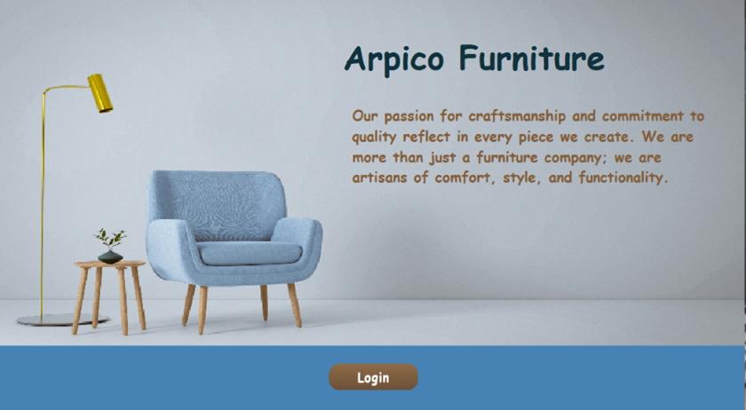
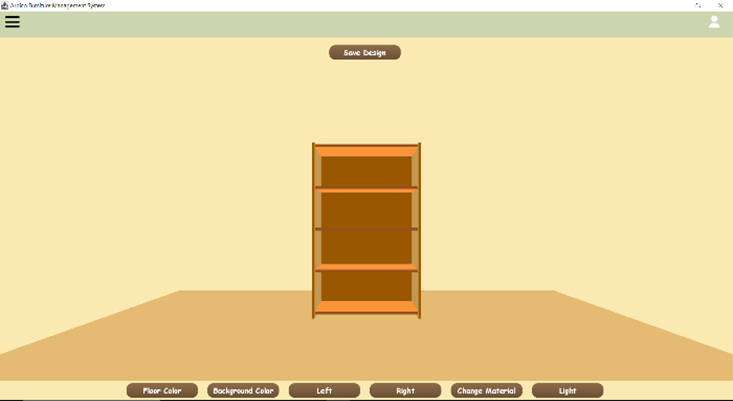

<p align="center">
  
  
</p>
<p align="center">Home Page (left) | Cupboard Design (right)</p>

<p align="center">
  
  
</p>
<p align="center">Chair 3D Model (left) | Color and Light Changes (right)</p>

<p align="center">
  
  
</p>
<p align="center">Bed 3D Model (left) | Computer Desk 3D Model (right)</p>

<p align="center">
  
  
</p>
<p align="center">Pantry Cupboard 3d Model(left) | Wood 3D Models (right)</p>

<p align="center">
  
  
</p>
<p align="center">Metal 3D Models (left) | Plastic 3D Models (right)</p>

# [Furniture Management System](#furniture-management-system)

## 📋 [Table of Contents](#table-of-contents)

1. 🤖 [Introduction](#introduction)
2. ⚙️ [Tech Stack](#tech-stack)
3. 🔋 [Features](#features)
4. 🤸 [Quick Start](#quick-start)

## 🤖 [Introduction](#introduction)

The Furniture Management System is a desktop application developed to assist staff at furniture design companies. The application allows designers to visualize and adjust furniture features in real-time, improving customer interaction and enhancing the overall design process. The system includes secure login, 2D and 3D visualization options, and various customization tools for colors, lighting, and rotation.

## ⚙️ [Tech Stack](#tech-stack)

- **Frontend**: Java (using Swing for GUI)
- **Backend**: OpenGL for 2D and 3D rendering
- **Development Environment**: IntelliJ IDEA
- **Dependencies**: Jogamp libraries for OpenGL

## 🔋 [Features](#features)

👉 **User Authentication**: Secure login for designers to prevent unauthorized access.

👉 **Furniture Customization**: Users can edit, save, and delete furniture designs, adjusting colors, lighting, and angles.

👉 **2D and 3D View Modes**: Toggle between 2D and 3D views to visualize furniture designs in multiple dimensions.

👉 **Interactive Design**: Rotate, change background and floor colors, and manage lighting to create realistic design simulations.

👉 **Data Persistence**: Save and load furniture designs for later use.

👉 **User-Centered Design**: Developed with feedback from users, following HCI principles.

## 🤸 [Quick Start](#quick-start)

To get started with this project, follow the steps below:

**1. Clone the Repository**
Copy this repository's URL and clone it to your local machine using the command:

```bash
git clone https://github.com/vidmal001/3D-Furniture-Designer.git
```

**2. Opening the Project in IntelliJ IDEA**

1. Open **IntelliJ IDEA**.
2. Navigate to **File -> Open**.
3. Locate the folder where you cloned the repository and select it.

**3. Configuring Dependencies**

Before running the application, you need to configure the OpenGL libraries in IntelliJ IDEA:

1. Download the required OpenGL libraries from [Jogamp](https://jogamp.org/), specifically version 2.5.0.

   - Download the `jogamp-all-platforms.7zip` file.

2. In your project directory, create the following folders:

   - **lib** (for libraries)
   - **bin** (for binaries)

3. Move the following files into the respective folders:

   - **lib** folder:
     - `gluegen-rt.jar`
     - `gluegen-rt-natives-windows-amd64.jar`
     - `jogl-all.jar`
     - `jogl-all-natives-windows-amd64.jar`
   - **bin** folder:
     - `j3dcore-ogl.dll`

4. To add the libraries in IntelliJ IDEA:
   - Go to **File -> Project Structure**.
   - Navigate to the **Libraries** tab.
   - Click on the **+** icon, select **Java**, and locate the `lib` and `bin` folders.
   - Click **OK** to confirm and add the libraries.

**4. Running the Application**

1. Open the `Main.java` file in the project.
2. Run the application from the `Main.java` file.
3. Use one of the following credentials to log in:
   - **Username**: `sandaru` | **Password**: `123`
   - **Username**: `seraan` | **Password**: `123`

Now you're all set to use the application!
